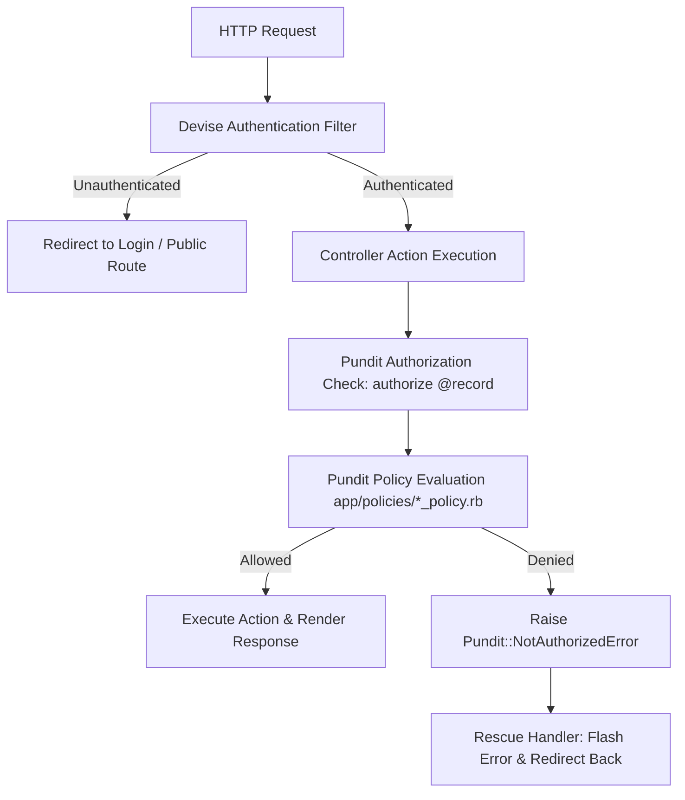

# Bridge Troll — Role-Based Authorization Matrix

We assessed commit `#40747c6510014958c9519d3708b5dc9325a0cc1c`

---

## 1. Overview & Legend

Bridge Troll enforces declarative Role-Based Access Control (RBAC) and Attribute-Based Access Control (ABAC) using **Pundit** policies (`app/policies/*_policy.rb`) coupled with **Devise** session authentication.

### Matrix Key
- `ALLOW` (✅): Permitted action
- `DENY` (❌): Forbidden action
- `OWNER` (👤): Permitted ONLY if the user owns the specific resource or RSVP
- `SCOPED` (🔒): Permitted ONLY within the user's assigned Chapter, Region, or Event

---

## 2. Authorization Matrix Table

| Resource / Action | Policy / Controller Method | Public / Unauthenticated | Regular User / Student / Volunteer | Event Checkiner | Event Organizer | Chapter Leader | Organization Leader | Publisher | Global Admin |
| :--- | :--- | :---: | :---: | :---: | :---: | :---: | :---: | :---: | :---: |
| **EVENTS** | | | | | | | | | |
| View Published Events | `events#index`, `show`, `feed` | ✅ | ✅ | ✅ | ✅ | ✅ | ✅ | ✅ | ✅ |
| View Unpublished Events | `EventPolicy#see_unpublished?` | ❌ | ❌ | ❌ | 🔒 (Own Event) | 🔒 (Chapter) | 🔒 (Org) | ✅ | ✅ |
| Create Event | `events#create` | ❌ | ✅ | ✅ | ✅ | ✅ | ✅ | ✅ | ✅ |
| Edit / Update Event | `EventPolicy#update?` | ❌ | ❌ | ❌ | 🔒 (Own Event) | 🔒 (Chapter) | 🔒 (Org) | ❌ | ✅ |
| Publish Event | `EventPolicy#publish?` | ❌ | ❌ | ❌ | ❌ | 🔒 (Chapter) | 🔒 (Org) | ✅ | ✅ |
| Flag Event | `EventPolicy#flag?` | ❌ | ❌ | ❌ | ❌ | ❌ | ❌ | ✅ | ✅ |
| Destroy Event | `EventPolicy#destroy?` | ❌ | ❌ | ❌ | 🔒 (Own Event) | 🔒 (Chapter) | 🔒 (Org) | ❌ | ✅ |
| Mass Email Attendees | `events/emails#create` | ❌ | ❌ | ❌ | 🔒 (Own Event) | 🔒 (Chapter) | 🔒 (Org) | ❌ | ✅ |
| Manage Event Checkins | `EventPolicy#checkin?` | ❌ | ❌ | 🔒 (Assigned Event) | 🔒 (Own Event) | 🔒 (Chapter) | ❌ | ❌ | ✅ |
| Arrange Sections / Diets | `organizer_tools#organize_sections` | ❌ | ❌ | ❌ | 🔒 (Own Event) | 🔒 (Chapter) | ❌ | ❌ | ✅ |
| **RSVPS & SURVEYS** | | | | | | | | | |
| Submit Event RSVP | `rsvps#create` | ❌ | ✅ | ✅ | ✅ | ✅ | ✅ | ✅ | ✅ |
| Edit / Cancel Own RSVP | `rsvps#update`, `destroy` | ❌ | 👤 (Own RSVP) | 👤 | 🔒 (Event RSVPs) | 🔒 (Chapter RSVPs) | ❌ | ❌ | ✅ |
| Submit Attendee Survey | `RsvpPolicy#survey?` | ❌ | 👤 (Own RSVP) | 👤 | 👤 | 👤 | 👤 | 👤 | 👤 |
| View Survey Results | `surveys#index` | ❌ | ❌ | ❌ | 🔒 (Own Event) | 🔒 (Chapter) | ❌ | ❌ | ✅ |
| **CHAPTERS & REGIONS** | | | | | | | | | |
| View Chapters / Regions | `chapters#index`, `show` | ✅ | ✅ | ✅ | ✅ | ✅ | ✅ | ✅ | ✅ |
| Create Chapter | `ChapterPolicy#new?` | ❌ | ❌ | ❌ | ❌ | ❌ | 🔒 (Own Org) | ❌ | ✅ |
| Update Chapter | `ChapterPolicy#update?` | ❌ | ❌ | ❌ | ❌ | 🔒 (Own Chapter) | 🔒 (Parent Org) | ❌ | ✅ |
| Modify Chapter Leadership | `ChapterPolicy#modify_leadership?` | ❌ | ❌ | ❌ | ❌ | 🔒 (Own Chapter) | 🔒 (Parent Org) | ❌ | ✅ |
| Destroy Chapter | `ChapterPolicy#destroy?` | ❌ | ❌ | ❌ | ❌ | ❌ | ❌ | ❌ | ✅ |
| Update Region Details | `RegionPolicy#update?` | ❌ | ❌ | ❌ | ❌ | ❌ | ❌ | ❌ | ✅ (or Region Leader) |
| **ORGANIZATIONS** | | | | | | | | | |
| Create Organization | `OrganizationPolicy#create?` | ❌ | ❌ | ❌ | ❌ | ❌ | ❌ | ❌ | ✅ |
| Manage Organization | `OrganizationPolicy#manage_organization?` | ❌ | ❌ | ❌ | ❌ | ❌ | 🔒 (Own Org) | ❌ | ✅ |
| Download Subscriptions | `organizations#download_subscriptions` | ❌ | ❌ | ❌ | ❌ | ❌ | 🔒 (Own Org) | ❌ | ✅ |
| **LOCATIONS & COURSES** | | | | | | | | | |
| Create Location | `locations#create` | ❌ | ✅ | ✅ | ✅ | ✅ | ✅ | ✅ | ✅ |
| Edit Location Notes/Contact | `LocationPolicy#edit_additional_details?` | ❌ | ❌ | ❌ | ❌ | ❌ | ❌ | ❌ | ✅ (or Region Leader) |
| Archive Location | `LocationPolicy#archive?` | ❌ | ❌ | ❌ | 🔒 (Event Location) | ❌ | ❌ | ❌ | ✅ (or Region Leader) |
| Manage Courses & Curricula | `CoursePolicy#create?` | ❌ | ❌ | ❌ | ❌ | ❌ | ❌ | ✅ | ✅ |
| Manage External Events | `ExternalEventPolicy#create?` | ❌ | ❌ | ❌ | ❌ | ❌ | ❌ | ✅ | ✅ |

---

## 3. Policy Enforcement Deep Dive

### Key Policy Enforcement Rules:
1. **Verification Mandatory**: `after_action :verify_authorized` mandates that every non-devise controller action MUST trigger Pundit or call `skip_authorization`.
2. **Mass Assignment Attributes**: Attribute permissions are dynamically resolved via `policy(record).permitted_attributes`, preventing parameter pollution / role tampering during updates.
